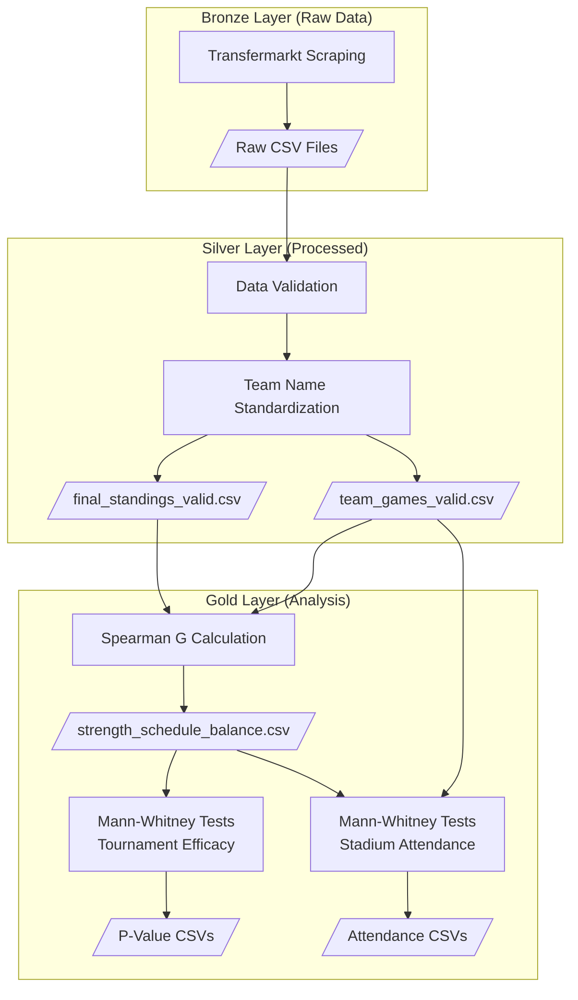

# Strength of Schedule Balance (SoSB) Experiment Documentation

This document explains the logic behind the Strength of Schedule Balance experiment implemented in this repository, verifies alignment between the code and the theoretical methodology, and provides guidance for conducting further tests.

---

## 1. Overview

This repository implements a complete data pipeline to investigate whether **Strength of Schedule Balance (SoSB)** influences:

1. **Tournament Efficacy** - Does the order in which teams face opponents affect their final league position?
2. **Stadium Attendance** - Does schedule balance correlate with average stadium occupancy?

The central hypothesis is that SoSB has **no discernible effect** on either metric. The analysis uses statistical tests to evaluate this hypothesis.

---

## 2. Theoretical Methodology vs. Implementation

### 2.1 Strength of Schedule Balance Calculation

| Aspect | Theory (Paper) | Implementation |
|--------|----------------|----------------|
| **Metric** | $B(\mathbf{S}_i)$ - Strength of Schedule Balance | `G` - Spearman's rank correlation coefficient |
| **R Vector** | Opponents ranked by final position (1, 2, 3...) | `R_array` - All opponent final positions, sorted ascending |
| **S Vector** | Actual opponents faced, in chronological order | `S_array` - Opponent positions in order they were faced |
| **Scope** | First half of season only (single round-robin) | Uses `_get_first_round_opponents()` to get unique opponents in first encounter order |

> [!TIP]
> The implementation correctly considers only the **first half** of the season by extracting the first encounter with each opponent, emulating a single round-robin tournament.

**Code Reference:** [spearman_coeff_calculate.py](file:///home/jplmm/ScheduleImbalance/soccer-scraper/src/analysis/spearman_coeff_calculate.py#L52-L96)

### 2.2 Schedule Classification Groups

| Theory | Implementation | Description |
|--------|----------------|-------------|
| $G_0$ | `balanced` | $-0.3 \leq B(\mathbf{S}_i) \leq 0.3$ |
| $G_{-}$ | `unbalanced_weak` | $B(\mathbf{S}_i) < -0.3$ (stronger opponents early) |
| $G_{+}$ | `unbalanced_strong` | $B(\mathbf{S}_i) > 0.3$ (weaker opponents early) |

**Code Reference:** The classification uses threshold `0.3` as specified in `G_TYPE_COLUMN_TO_ANALYZE = "G_type_0.300"`.

```python
# From spearman_coeff_calculate.py
def _classify_g_type(g, p_value, correlation_threshold, significance_level):
    if g > correlation_threshold:
        return "unbalanced_strong"
    elif g < -correlation_threshold:
        return "unbalanced_weak"
    else:
        return "balanced"
```

### 2.3 Statistical Testing

The implementation uses the **Mann-Whitney U Test** (non-parametric) to compare distributions between groups:

| Comparison | Purpose |
|------------|---------|
| G- vs G0 | Unbalanced weak vs Balanced |
| G- vs G+ | Unbalanced weak vs Unbalanced strong |
| G0 vs G+ | Balanced vs Unbalanced strong |

A **p-value < 0.05** indicates statistically significant differences between groups.

---

## 3. Verification: Theory vs. Implementation Alignment

### ✅ Correct Implementation Aspects

1. **First-Half Only Analysis**: The `_get_first_round_opponents()` function correctly extracts unique opponents in chronological order, representing the first round-robin.

2. **0.3 Threshold**: The default threshold matches the theoretical methodology (`G_TYPE_COLUMN_TO_ANALYZE = "G_type_0.300"`).

3. **Spearman Correlation**: Uses `scipy.stats.spearmanr` to calculate correlation between ideal (R) and actual (S) schedules.

4. **Group Mapping**: Correctly maps internal names to display names:
   ```python
   GROUP_MAP = {"unbalanced_weak": "G-", "balanced": "G0", "unbalanced_strong": "G+"}
   ```

### ⚠️ Extended Functionality (Beyond Paper)

1. **Multiple Thresholds**: The code tests multiple thresholds `[0.2, 0.25, 0.3, 0.35, 0.4]` for sensitivity analysis.

2. **Multiple Leagues**: While the paper focuses on English Premier League, this implementation includes 21 different leagues globally.

3. **Multiple Attendance Imputation Methods**: Tests with `audience_filled_fb`, `audience_filled_mean`, `audience_filled_median`.

---

## 4. Data Pipeline Architecture



---

## 5. Key Output Files

| File | Description |
|------|-------------|
| `data/gold/analysis/spearman_coefficient/strength_schedule_balance.csv` | G coefficient for each team-season |
| `data/gold/analysis/mann_whitney/metrics/seasons/overall_mann_whitney_p_values.csv` | P-values for tournament efficacy |
| `data/gold/analysis/mann_whitney/metrics/attendance/attendance_p_values_consolidated.csv` | P-values for attendance analysis |
| `data/gold/analysis/schedules_data/individual/*.json` | Raw R and S arrays for auditing |

---

## 6. How to Run Further Tests

### 6.1 Running the Complete Pipeline

```bash
# Activate virtual environment
source .venv/bin/activate

# Run all pipelines (scrape → process → analysis)
uv run main.py all

# Or run individual stages
uv run main.py scrape      # Extract raw data from Transfermarkt
uv run main.py process     # Validate and clean data
uv run main.py analysis    # Calculate G coefficients and run tests
```

### 6.2 Testing Different Thresholds

The code already calculates G-types for multiple thresholds. To change which threshold is used for Mann-Whitney tests, modify:

```python
# In src/analysis/mann_whitney_seasons.py (line 27)
G_TYPE_COLUMN_TO_ANALYZE = "G_type_0.300"  # Change to G_type_0.200, etc.
```

Available threshold columns: `G_type_0.200`, `G_type_0.250`, `G_type_0.300`, `G_type_0.350`, `G_type_0.400`

### 6.3 Adding New Leagues

To add a new league, edit `src/scraper/constants.py`:

```python
LEAGUES = {
    # ... existing leagues ...
    "new_league_key": {
        "name": "League Display Name",
        "slug": "league-slug-from-transfermarkt",
        "code": "LEAGUE_CODE",
        "start_year": 2010,  # First season to scrape
        "processed": True,
    },
}
```

Then run:
```bash
uv run main.py all
```

### 6.4 Filtering to Specific Leagues/Seasons

To replicate the paper's analysis (Premier League only, 2001-2024 excluding COVID seasons):

1. **Option A**: Filter the output CSV files after analysis
2. **Option B**: Modify the processor to filter seasons before analysis

Example Python filter:
```python
import pandas as pd

df = pd.read_csv("data/gold/analysis/spearman_coefficient/strength_schedule_balance.csv")

# Filter to Premier League, excluding COVID seasons
df_filtered = df[
    (df["league_name"] == "premierleague") &
    (df["season_year"] >= 2001) &
    (df["season_year"] <= 2024) &
    (~df["season_year"].isin([2019, 2020]))  # Exclude COVID seasons
]
```

### 6.5 Testing Different Attendance Metrics

Modify in `src/analysis/mann_whitney_attendance.py`:

```python
# Line 28 - Choose one of:
ATTENDANCE_COLUMN = "audience_filled_fb"      # Forward/backward fill
ATTENDANCE_COLUMN = "audience_filled_mean"    # Season mean imputation
ATTENDANCE_COLUMN = "audience_filled_median"  # Season median imputation
ATTENDANCE_COLUMN = "audience"                # Raw (with nulls)
```

---

## 7. Interpreting Results

### P-Value Interpretation

| P-Value Range | Interpretation |
|---------------|----------------|
| p < 0.01 | Strong evidence against null hypothesis |
| 0.01 ≤ p < 0.05 | Moderate evidence against null hypothesis |
| 0.05 ≤ p < 0.10 | Weak evidence (marginally significant) |
| p ≥ 0.10 | Insufficient evidence to reject null hypothesis |

### Expected Results (If Hypothesis is Correct)

If SoSB has **no effect**:
- Most p-values should be > 0.05
- Significance rate across all tests should be ~5% (due to chance)
- No consistent pattern across leagues or seasons

### Reading the Summary Statistics

From `overall_mann_whitney_p_values.csv`:
- `significant_percentage`: Proportion of tests with p < 0.05
- `significant_G-_vs_G+`: Count of significant tests between extreme groups

---

## 8. Extending the Analysis

### 8.1 Alternative Statistical Tests

You could implement additional tests in `src/analysis/`:

- **Kruskal-Wallis Test**: Non-parametric comparison across all three groups simultaneously
- **Permutation Tests**: Bootstrap-based significance testing
- **Effect Size Metrics**: Cohen's d, Cliff's delta for practical significance

### 8.2 Additional Metrics to Analyze

Extend the analysis to test SoSB effects on:

- Goals scored in the first half of the season
- Points accumulated in the first N rounds
- Home vs. away performance differences
- Team performance trends (improvement/decline over season)

### 8.3 Temporal Analysis

Investigate whether SoSB effects have changed over time by:

1. Splitting seasons into decades
2. Testing for interaction effects between era and schedule balance
3. Examining if modern parity has reduced SoSB importance

---

## 9. Data Quality Notes

The processor validates data quality with several checks:

| Check | Description |
|-------|-------------|
| `is_double_rounded` | Total games = N*(N-1) for N teams |
| `is_valid_attendance` | <5% games with null attendance |
| `has_all_teams_files` | Games file exists for every team |
| `is_valid_url` | Team URLs correspond to correct season |

Only seasons passing ALL validation checks are included in analysis.

---

## 10. Summary

This repository correctly implements the Strength of Schedule Balance methodology:

- ✅ Uses Spearman's rank correlation for B(S) calculation
- ✅ Considers only first-half schedules (single round-robin)
- ✅ Applies 0.3 threshold for group classification
- ✅ Uses Mann-Whitney U tests for statistical comparison
- ✅ Analyzes both tournament efficacy and stadium attendance

The implementation **extends** the theoretical framework by:
- Testing multiple thresholds (0.2 to 0.4)
- Including 21 leagues across multiple countries
- Providing sensitivity analysis for attendance imputation methods
